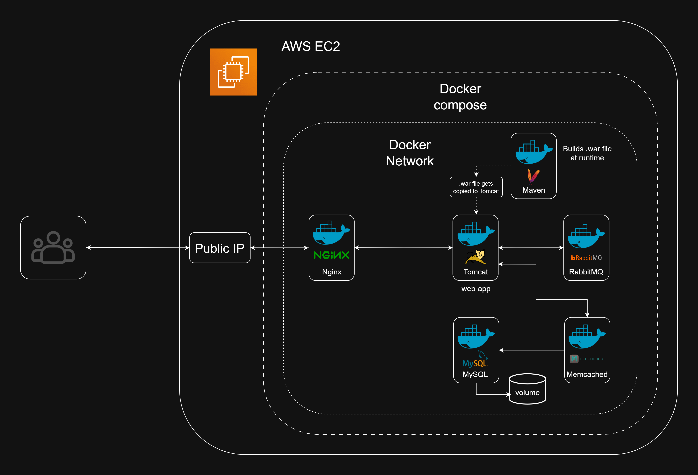

# Multi-Service Java Web Application Deployment with Docker Compose on AWS EC2

[](#)
[](#)
[](#)

## About the 3-Project DevOps System

This project is the foundational stage of a self-designed 3-part DevOps portfolio projects designed to mirror the progression of infrastructure maturity in real-world engineering environments — from containerization, to orchestration, to full automation and observability.

- **Project 1 (this)**: Multi-service containerization and deployment using Docker Compose on AWS EC2  
- **Project 2**: Kubernetes orchestration of the same application stack on AWS EKS - [Project 2](https://github.com/ravi-rajyaguru15/Project-02-eks-k8s-infrastructure-orchestration)
- **Project 3**: Infrastructure-as-Code with Terraform, CI/CD via GitHub Actions, and monitoring using Prometheus and Grafana - [Project 3](https://github.com/ravi-rajyaguru15/Project-03-terraform-cicd-observability-pipeline)

The Java web application used in this project was externally sourced. However, to ensure the system appeared more production-ready and portfolio-appropriate, all course-specific branding was removed. UI elements and presentation were modified to reflect a generic, open-source-style internal platform. This allowed full attention to be directed toward infrastructure, deployment, and DevOps process engineering.

---

## Project Overview

This project simulates a production-style deployment of a multi-tier Java web application stack using Docker Compose, hosted on an AWS EC2 instance.

It demonstrates containerized deployment of:

- A custom Java web app (Tomcat + Maven build)
- MySQL (database)
- RabbitMQ (message queue)
- Memcached (cache)
- Nginx (reverse proxy)

---

## Architecture Overview


---

## Tech stack

- **Infrastructure**: AWS EC2 (Ubuntu)
- **Containers**: Docker, Docker Compose
- **App Stack**: Tomcat, Maven, MySQL, RabbitMQ, Memcached
- **Routing**: Nginx (reverse proxy)
- **Configuration**: `.env` file for environment variables

---

## Repository Structure

```text
Project_01/
│ 
├── app/
│   ├── Dockerfile                              # Multi-stage Dockerfile (Maven -> Tomcat)
│   ├── src/                                    # Java web app source files
│   └── pom.xml                                 # Maven project file
├── mysql/
│   ├── Dockerfile                              # MySQL Dockerfile
│   └── db_backup.sql                           # .sql file to seed the MySQL database
├── nginx/
│   └── default.conf                            # Reverse proxy configuration
├── images/
|   ├── screenshots/                            # Screenshots of running services, EC2 instance, web app on EC2 public IP, etc.  
│   └── architecture/
|         └── project-1-architecture.png        # Architecture overview diagram of Project 1
├── .env                                        # Environment file to store credentials for MySQL and RabbitMQ
├── docker-compose.yaml                         # Docker compose file that defines 5 services
└── README.md                                   # Project README (You are here) (Inception!)
```

---

## How to Deploy (Reproduction Steps)

This can be reproduced on any Linux-based AWS EC2 instance.

1. Provision an EC2 instance (Example: Ubuntu Server 24.04 LTS, t2.medium, 25 GB gp storage), with a key-pair login and appropriate security group.

2. Login to the EC2 instance via SSH using generated key.  

3. Install Docker and Docker Compose.  

4. Copy the project files to the EC2 instance via git clone, and navigate into the project folder.   

5. Run:
    
    ```bash
    docker compose up --build -d
    ```
6. Verify running containers:
    
    ```bash
    docker ps
    ```
7. Access the application using the EC2 Public IP: 
    
    ```bash
    http://<EC2-public-IP>:80
    ```
8. After verification of web app, stop and clean the docker compose services:
    
    ```bash
    docker-compose down -v --rmi all
    ```
9. Terminate the EC2 instance if not needed to avoid incurring unnecessary AWS costs.    

---

## Engineering Insights

- Built a multi-container system using Docker Compose with proper inter-service networking
- Used Maven as a containerized build tool to produce `.war` files for Tomcat deployment
- Replaced hardcoded credentials with dynamic `.env` file for config management
- Implemented Nginx as a reverse proxy to forward traffic to the Tomcat app container
- Practiced real-world deployment and debugging using an actual EC2 instance (not locally)
- Debugged container startup sequences, port conflicts, and Docker networking quirks

---

## What This Project Demonstrates

- Solid foundation in containerized deployment  
- Hands-on experience with multi-service orchestration  
- Real-world AWS provisioning and service exposure  
- Practical application of `.env` for secure, flexible configuration  
- Clean separation of services with composable infrastructure
- Use of mult-stage Dockerfile to reduce image size and isolate build from runtime.

---

## Attribution
The Java web application used in this project was externally sourced. All containerization, orchestration, deployment strategy, and infrastructure setup were independently implemented. Although modifying the frontend was beyond the initial scope, and also to ensure the system appeared more production-ready and portfolio-appropriate, all course-specific branding was removed; UI elements and presentation were modified to reflect a generic, open-source-style web application. 

A delibrate and calculated decision was also made to use the same web apllication throughout all 3 projects. This allowed full attention to be directed towards infrastructure, deployment, and DevOps process engineering.

---