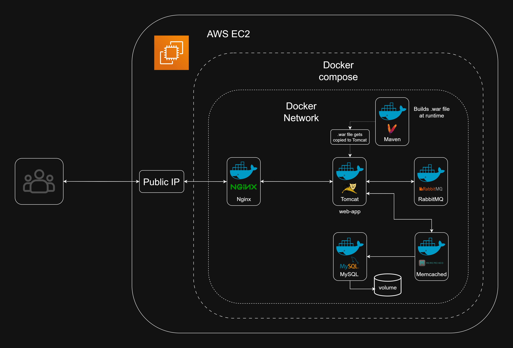

# Multi-Service Java Web Application Deployment with Docker Compose on AWS EC2

[](#)
[](#)
[](#)

## About the 3-Project DevOps System

This self-designed, 3-part DevOps portfolio series is intended to demonstrate the staged cloud migration and infrastructure maturity path of a multi-service web application: from containerization, to Kubernetes orchestration, to infrastructure automation, CI/CD, and observability.

- **Project 1 (this)**: Multi-service containerization and deployment using Docker Compose on AWS EC2  
- **Project 2**: Kubernetes orchestration of the same application stack on AWS EKS - [Project 2](https://github.com/ravi-rajyaguru15/Project-02-eks-k8s-infrastructure-orchestration)
- **Project 3**: Infrastructure as Code with Terraform, CI/CD via GitHub Actions, and monitoring using Prometheus and Grafana - [Project 3](https://github.com/ravi-rajyaguru15/Project-03-terraform-cicd-observability-pipeline)

The Java web application used across this portfolio is externally sourced. Minor UI/content adjustments are made to remove source-specific branding and present it as a neutral demo web application. The infrastructure design, containerization, cloud deployment, Kubernetes manifests, Terraform configuration, CI/CD workflow setup, monitoring integration, documentation, troubleshooting, and migration-stage decisions were independently implemented. The same application stack is intentionally reused across all three projects so the focus remains on infrastructure maturity and core DevOps practices.

---

## Project Overview

This project demonstrates the first migration stage: containerizing a multi-service Java web application stack and running it on a cloud-hosted Linux environment using AWS EC2 and Docker Compose.

It showcases containerized deployment of:

- A custom Java web app running on Tomcat, with Maven used during the build process
- MySQL as the database
- RabbitMQ as the message queue
- Memcached as the cache layer
- NGINX as the reverse proxy

---

## Project Scope

This stage focuses on containerization, service networking, reverse proxy configuration, environment-based runtime configuration, deployment reproducibility, and hands-on troubleshooting.

It is not intended to represent a fully production-operated system. High availability, advanced security hardening, centralized monitoring/logging, backup strategy, and automated delivery workflows are intentionally outside the scope of this first stage. Some of these areas are introduced progressively in later projects, while others represent areas I aim to deepen through professional cloud/platform engineering experience.

---

## Architecture Overview


---

## Tech Stack

- **Infrastructure**: AWS EC2 (Ubuntu)
- **Containers**: Docker, Docker Compose
- **App Stack**: Tomcat, Maven, MySQL, RabbitMQ, Memcached
- **Routing**: NGINX (reverse proxy)
- **Configuration**: `.env` file for environment variables

---

## Repository Structure

```text
Project_01/
│ 
├── app/
│   ├── Dockerfile                              # Multi-stage Dockerfile (Maven -> Tomcat)
│   ├── src/                                    # Java web app source files
│   └── pom.xml                                 # Maven project file
├── mysql/
│   ├── Dockerfile                              # MySQL Dockerfile
│   └── db_backup.sql                           # .sql file to seed the MySQL database
├── nginx/
│   └── default.conf                            # Reverse proxy configuration
├── images/
|   ├── screenshots/                            # Screenshots of running services, EC2 instance, web app on EC2 public IP, etc.  
│   └── architecture/
|         └── project-1-architecture.png        # Architecture overview diagram of Project 1
├── .env                                        # Environment file to store credentials for MySQL and RabbitMQ
|                                                 (This is for demonstration purposes only, and is not suitable for actual production security best practices.)
| 
├── docker-compose.yml                         # Docker compose file that defines 5 services
└── README.md                                   # Project README 
```

---

## How to Deploy (Reproduction Steps)

This can be reproduced on any Linux-based AWS EC2 instance.

1. Provision an EC2 instance (Example: Ubuntu Server 24.04 LTS, t2.medium, 25 GB gp3 storage), with a key-pair login and appropriate security group.

2. Login to the EC2 instance via SSH using generated key.  

3. Install Docker and Docker Compose.  

4. Copy the project files to the EC2 instance via git clone, and navigate into the project folder.   

5. Run:
    
    ```bash
    docker compose up --build -d
    ```
6. Verify running containers:
    
    ```bash
    docker ps
    ```
7. Access the application using the EC2 Public IP: 
    
    ```bash
    http://<EC2-public-IP>:80
    ```
8. After verification of web app, stop and clean the docker compose services:
    
    ```bash
    docker compose down -v --rmi all
    ```
9. Terminate the EC2 instance if not needed to avoid incurring unnecessary AWS costs.    

---

## Engineering Insights

- Built a multi-container application stack using Docker Compose with basic inter-service startup ordering.
- Used Maven as part of a containerized build process to produce a `.war` file for Tomcat deployment.
- Used an `.env` file for environment-based runtime configuration instead of hardcoded credentials in the Compose file. 
- Configured NGINX as a reverse proxy to forward traffic to the Tomcat application container.
- Practiced cloud-based deployment and troubleshooting on an actual AWS EC2 instance instead of a local-only environment.
- Debugged container startup ordering, port conflicts, environment configuration, and Docker networking issues.

---